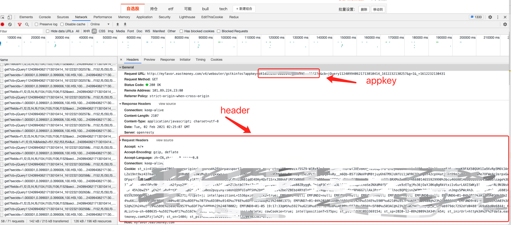

[](https://pypi.org/project/eastmoneypy/)
[](https://pypi.org/project/eastmoneypy/)
[](https://pypi.org/project/eastmoneypy/)
[](https://github.com/zvtvz/eastmoneypy/actions/workflows/build.yml)
[](https://github.com/zvtvz/eastmoneypy/actions/workflows/package.yaml)

eastmoneypy是使用python来对[东方财富](http://www.eastmoney.com/)进行操作的一个库。  
目前在[zvt](https://github.com/zvtvz/zvt)中用于选股后自动添加到东财app，可参考该[issue](https://github.com/zvtvz/zvt/issues/48)
## 实现功能：
- [x] 管理组合
- [x] 添加A股标的到组合
- [x] 添加板块到组合
- [x] 添加港股
- [x] 添加美股
- [ ] 添加ETF


## 安装
```
pip3 install -U eastmoneypy
```

## 设置

打开网址并登录:http://quote.eastmoney.com/zixuan/

<p align="center"></p>

在用户目录里面，找到eastmoney-home/config.json，设置header和appkey
```
{
  "header": "parse your total header here",
  "appkey": "parse your appkey here"
}
```

## 使用

### 获取自选组合
```
In [1]: from eastmoneypy import *
In [2]: get_groups()
Out[2]:
[{'id': '130357503', 'name': '自选股', 'version': '322', 'source': 'web'},
 {'id': '348275488', 'name': 'inging', 'version': '17', 'source': 'web'},
 {'id': '215892391', 'name': '持仓', 'version': '118', 'source': 'mobile'},
 {'id': '327237386', 'name': '港股', 'version': '6', 'source': 'mobile'},
 {'id': '235046679', 'name': '刘世军', 'version': '10', 'source': 'mobile'},
 {'id': '327744616', 'name': 'etf', 'version': '22', 'source': 'mobile'},
 {'id': '350053618', 'name': 'tech', 'version': '0', 'source': 'web'},
 {'id': '350485893', 'name': '你好', 'version': '0', 'source': 'web'},
 {'id': '130357521', 'name': '持仓股', 'version': '1', 'source': 'mobile'}]
```

### 创建组合
```
In [3]: create_group('tmp')
Out[3]: (True, {'gid': '350518464', 'msg': '添加组合成功'})
```

### 添加股票到组合
```
>>> add_to_group('000999', group_name='tmp')
>>> add_to_group('BK1003', group_name='概念',entity_type='block')
>>> add_to_group('MSFT', group_name='tmp', entity_type='stockus')
>>> add_to_group('00700', group_name='tmp' entity_type='stockhk')
```

### 删除组合
```
In [5]: del_group('tmp')
```

## 联系方式

个人微信:foolcage 添加暗号:zvt  


------
微信公众号:  


知乎专栏:  
https://zhuanlan.zhihu.com/automoney
