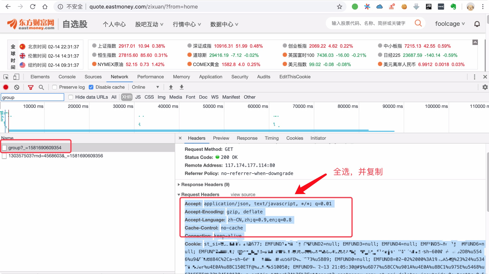

[](https://pypi.org/project/eastmoneypy/)
[](https://pypi.org/project/eastmoneypy/)
[](https://pypi.org/project/eastmoneypy/)
[](https://travis-ci.org/zvtvz/eastmoneypy)
[](https://codecov.io/github/zvtvz/eastmoneypy)
[](http://hits.dwyl.io/zvtvz/eastmoneypy)

eastmoneypy是使用python来对[东方财富](http://www.eastmoney.com/)进行操作的一个库。  
目前在[zvt](https://github.com/zvtvz/zvt)中用于选股后自动添加到东财app，可参考该[issue](https://github.com/zvtvz/zvt/issues/48)
## 实现功能：
- [x] 管理组合
- [x] 添加A股标的到组合
- [ ] 添加ETF
- [ ] 添加港股


## 安装
```
pip3 install eastmoneypy -i http://pypi.douban.com/simple --trusted-host pypi.douban.com
```

## 设置

打开网址并登录:http://quote.eastmoney.com/zixuan/

<p align="center"></p>

在用户目录里面，找到eastmoney-home/config.json，把copy的header设置到里面
```
{
  "header": "parse your total header here"
}
```

## 使用

### 获取自选组合
```
In [1]: from eastmoneypy import *
In [2]: get_groups()
Out[2]:
[{'id': '130357503', 'name': '自选股', 'version': '322', 'source': 'web'},
 {'id': '348275488', 'name': 'inging', 'version': '17', 'source': 'web'},
 {'id': '215892391', 'name': '持仓', 'version': '118', 'source': 'mobile'},
 {'id': '327237386', 'name': '港股', 'version': '6', 'source': 'mobile'},
 {'id': '235046679', 'name': '刘世军', 'version': '10', 'source': 'mobile'},
 {'id': '327744616', 'name': 'etf', 'version': '22', 'source': 'mobile'},
 {'id': '350053618', 'name': 'tech', 'version': '0', 'source': 'web'},
 {'id': '350485893', 'name': '你好', 'version': '0', 'source': 'web'},
 {'id': '130357521', 'name': '持仓股', 'version': '1', 'source': 'mobile'}]
```

### 创建组合
```
In [3]: create_group('tmp')
Out[3]: (True, {'gid': '350518464', 'msg': '添加组合成功'})
```

### 添加股票到组合
```
In [4]: add_to_group('000999',group_name='tmp')
2020-02-14 23:34:55,287  INFO  MainThread  ret:{'re': True, 'message': '', 'result': {'ver': '1', 'msg': '添加股票成功'}}
Out[4]: True
```

### 删除组合
```
In [5]: del_group('tmp')
```

## 联系方式  

QQ群:300911873  

个人微信:foolcage 添加暗号:zvt  


------
微信公众号:  


知乎专栏:  
https://zhuanlan.zhihu.com/automoney
